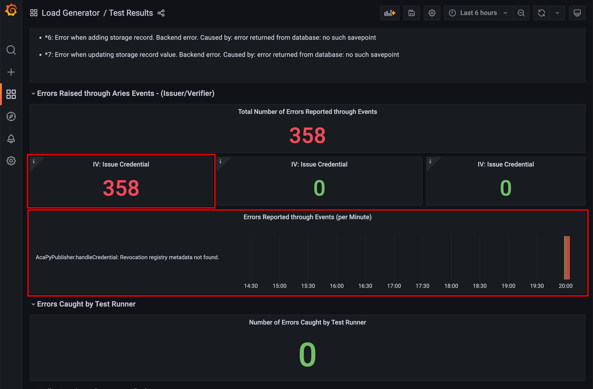

# Load Generator to reproduce AcaPy "Revocation registry metadata not found" Errors

This repository is a fork of the [Aries Cloud Agent Load Generator](https://github.com/My-DIGI-ID/aries-cloudagent-loadgenerator). It configures the load generator specifically to reproduce AcaPy "Revocation registry metadata not found" Errors.

## Install Dependencies
- docker
- docker-compose

## Run the Load Generator
```
./setup/manage.sh start
```

## View the Test Results
1. Open http://localhost:3000/d/0Pe9llbnz/test-results to the test results visualized in a Grafana dashboard.
2. Scroll down to: 

## Sample Test Results with "Revocation registry metadata not found" errors
- https://github.com/lissi-id/acapy-load-test-results/tree/main/Full%20Flow%20Increasing%20Load/08%20AcaPy%200_7_3%20askar_wallet
- https://github.com/lissi-id/acapy-load-test-results/tree/main/Full%20Flow%20Constant%20Load/08%20AcaPy%200_7_3%20askar_wallet
